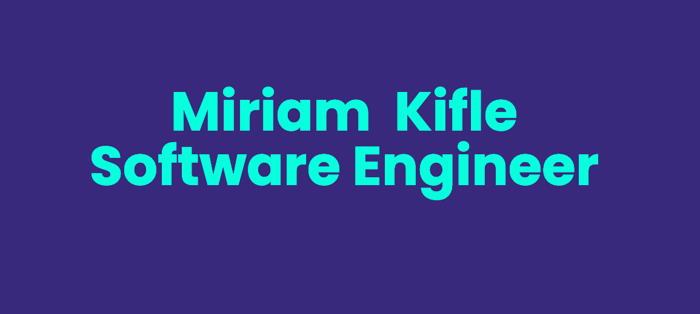

# Hi there 👋 ,  I'm Miriam!

<p align="center">
  
</p>


I am a Software Engineer based in Boston, MA proficient in both frontend and backend development with extensive knowledge in Javascript, Node.Js, MongoDB, HTML, CSS, and React.

When I’m not coding, you can find me cozied up with a good book or jamming to great music.

###  A little more about me...  

```javascript
const miriam = {
  pronouns: ["she" | "her"], 
  code: [Javascript, HTML, CSS],
  tools: [React, Redux, Node, MongoDB], 
  enjoys: [waterRafting, reading, listeningToMusic]
}
```
 <em><b>I love meeting people</b> so don't be shy to say hi. <b>I'll be more than happy to connect!</b> :)</em>


## Find me around the web 🌎: <a href=""></a>
- Learning in public on <a href="https://codepen.io/MIRIYUZ">Codepen</a> or <a href="https://www.miriamkifle.dev">miriamdev.netlify.app</a> 📹 ✍🏾
- Tweeting on <a href="https://twitter.com/miriamkifle"> Twitter</a> 🏓
- Sharing updates on <a href="https://www.linkedin.com/in/miriam-kifle/">LinkedIn</a> 💼


<!--
**MiriamKifle/MiriamKifle** is a ✨ _special_ ✨ repository because its `README.md` (this file) appears on your GitHub profile.

Here are some ideas to get you started:

- 🔭 I’m currently working on ...
- 🌱 I’m currently learning ...
- 👯 I’m looking to collaborate on ...
- 🤔 I’m looking for help with ...
- 💬 Ask me about ...
- 📫 How to reach me: ...
- 😄 Pronouns: ...
- ⚡ Fun fact: ...
-->
